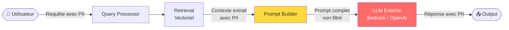
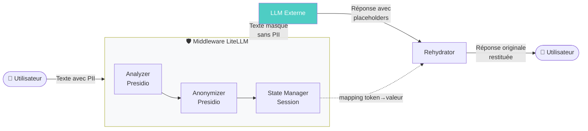
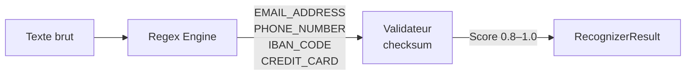
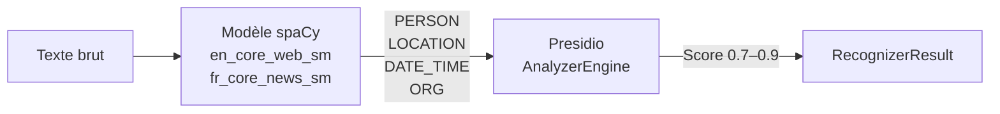
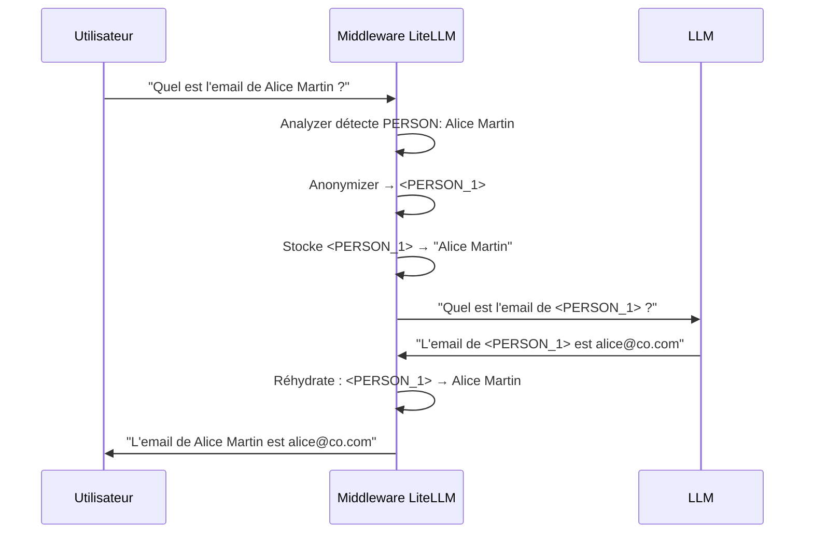

# Protéger les données personnelles dans vos pipelines RAG : l'approche Presidio

**Catégories :** IA, Sécurité, RGPD, RAG  
**Temps de lecture :** 8 min

---

Construire un système RAG performant, c'est bien. Construire un système RAG conforme au RGPD sans dégrader l'expérience utilisateur, c'est un autre niveau de complexité. Et pourtant, c'est exactement ce qu'imposent les projets en production dès qu'ils manipulent des données réelles : contrats, tickets support, fiches clients, emails internes.

La question n'est plus "faut-il protéger les données personnelles ?" — c'est une obligation légale. La vraie question est : **comment le faire sans casser le pipeline, sans ralentir le modèle, et sans que les utilisateurs n'y voient que du feu ?**

Cet article présente la problématique, les choix architecturaux disponibles, et la solution que nous avons retenue chez Eurelis pour notre fork de RAGFlow : **Microsoft Presidio**, intégré comme middleware dans LiteLLM.

---

## RAG et RGPD : un couple sous tension

Un pipeline RAG orchestre plusieurs couches de traitement successives. À chaque étape, des données personnelles peuvent transiter — involontairement.

Trois vecteurs de fuite existent dans un pipeline RAG typique :

- **Les requêtes utilisateur** : un employé demande "quel est le numéro de téléphone de Marie Dupont ?" — la valeur elle-même transite vers le modèle externe.
- **Le contexte extrait** : le retrieval rapatrie des fragments de documents qui peuvent contenir des noms, emails, coordonnées bancaires ou dates de naissance issues de la base documentaire.
- **Les sorties du modèle** : le LLM peut reformuler, récapituler ou halluciner en s'ancrant sur des données personnelles présentes dans le contexte.

Le RGPD est clair là-dessus : l'Article 5.1.c impose la **minimisation des données**, l'Article 32 exige des **mesures techniques appropriées**, et l'Article 25 consacre le principe de **Privacy by Design**. Transmettre des données personnelles non pseudonymisées à un modèle hébergé par un tiers est, dans la majorité des cas, une violation de ces principes.

---

## L'architecture cible : intercepter à la source

La réponse architecturale consiste à introduire une **couche de masquage centralisée**, positionnée entre le pipeline RAG et le modèle de langage. Cette couche :

1. **Détecte** les entités personnelles dans les messages entrants (requêtes utilisateur + contexte RAG)
2. **Substitue** les valeurs par des placeholders typés (`<PERSON_1>`, `<EMAIL_ADDRESS_2>`)
3. **Transmet** le texte pseudonymisé au LLM
4. **Réhydrate** la réponse — remplace les placeholders par les valeurs originales avant restitution à l'utilisateur

Le LLM ne voit jamais les valeurs personnelles originales. Il travaille exclusivement sur des tokens (`<PERSON_1>`) qu'il manipule de façon cohérente dans sa réponse. La réhydratation côté client reconstitue la réponse finale.

👉 C'est ce qu'on appelle le **masquage réversible** — ou réhydratation — et c'est ce qui distingue cette approche d'un simple filtrage destructif.

---

## Pourquoi Presidio plutôt que les alternatives ?

Le marché propose plusieurs solutions. Nous les avons évaluées sur quatre critères : précision de détection, latence, capacité de réhydratation, et intégration LiteLLM.

| Critère | LLM Guard | Rehydra SDK | OpenAI Filter | **Microsoft Presidio** |
|---------|-----------|-------------|---------------|------------------------|
| Architecture | Modulaire | Zero-Trust | Inline API | Analyzer + Anonymizer découplés |
| Réhydratation | ❌ Non native | ✅ Native | ❌ Non | ✅ Via opérateur custom |
| Déploiement | OSS self-hosted | SaaS (payant) | SaaS OpenAI only | **OSS, licence MIT** |
| Intégration LiteLLM | Via callbacks | Via proxy | Non documentée | **Native — CustomLogger** |
| Entités supportées | 20+ | Configurable | Limité | **50+ types OOTB** |
| Latence | Moyenne | Faible | Très faible | **~5–15 ms / phrase** |

**LLM Guard** est séduisant mais ne propose pas de réhydratation native — ce qui le rend inutilisable pour nos besoins de cohérence conversationnelle.

**Rehydra SDK** est techniquement le plus sophistiqué, mais son modèle SaaS commercial crée une dépendance externe incompatible avec les exigences de souveraineté de plusieurs de nos clients.

**Microsoft Presidio** cumule les avantages décisifs : open source (MIT), auto-hébergeable, 50+ types d'entités prédéfinis, moteur NLP configurable (spaCy, Stanza, Hugging Face), et une architecture découplée qui permet d'auditer les détections sans modifier les textes.

---

## Comment Presidio détecte les données personnelles

Presidio combine trois techniques complémentaires pour couvrir le spectre des PII rencontrées en entreprise.

### Expressions régulières — les PII structurées

Les données à format normalisé (emails, numéros de téléphone, IBAN, cartes bancaires) sont détectées par regex avec validation par checksum pour les entités qui le permettent :

La validation par algorithme de Luhn (cartes bancaires, SIRET) ou MOD-97 (IBAN) réduit drastiquement les faux positifs.

### NER spaCy — les PII non structurées

Les noms de personnes, lieux et dates contextuelles ne suivent aucun format. Ils nécessitent un **modèle de Reconnaissance d'Entités Nommées (NER)** entraîné sur des corpus de langue naturelle :

spaCy s'impose pour la production grâce à ses modèles Cython pré-compilés (3–5 ms / phrase en mode `sm`), son pipeline stateless compatible avec le déploiement multi-instances, et sa neutralité vis-à-vis du fournisseur LLM.

### Recognizers métier — les PII propriétaires

Presidio permet d'enregistrer des recognizers custom pour les identifiants internes à l'entreprise : matricules employés, numéros de dossier, codes client. Un mécanisme de **mots contextuels boosteurs** augmente le score de confiance quand le terme apparaît dans un contexte cohérent (`CLI-12345678` après le mot "client" → score 1.0 vs 0.9 hors contexte).

---

## La réhydratation : faire croire au LLM qu'il n'a rien manqué

Le challenge technique de la réhydratation n'est pas trivial. Deux propriétés doivent être garanties sur l'ensemble d'une conversation :

**Cohérence** — `alice@example.com` mentionné trois fois dans la conversation doit toujours produire le même placeholder `<EMAIL_ADDRESS_1>`, quelle que soit sa position dans les messages.

**Non-collision** — le remplacement de `<PERSON_10>` ne doit pas affecter `<PERSON_1>`. Le tri par longueur décroissante des clés résout ce problème.

En mode **streaming SSE** (génération token par token), un placeholder peut être coupé entre deux chunks (`<PERS` dans le chunk 1, `ON_1>` dans le chunk 2). Le buffer de réhydratation retient l'émission dès qu'un `<` non fermé est détecté — et libère le contenu sûr au fur et à mesure.

---

## Ce que cela change dans un projet RAG en production

Cette architecture présente trois bénéfices concrets pour les équipes projet :

**Point de contrôle unique.** La logique de protection réside entièrement dans la couche middleware LiteLLM. RAGFlow ne sait pas que le masquage existe. Les applications clientes non plus. C'est un principe d'architecture que nous appliquons systématiquement : *les règles de compliance ne doivent pas fuiter dans la logique métier.*

**Neutralité fournisseur.** Ajouter Mistral, Gemini ou un modèle Ollama local ne modifie pas la couche de protection. Le masquage opère en amont de la sélection du modèle cible.

**Auditabilité RGPD.** La séparation Analyzer / Anonymizer permet de journaliser les *types* d'entités détectées et les scores de confiance, sans jamais exposer les valeurs originales dans les logs — ce qui est exactement ce qu'exige un DPO.

---

## Pour aller plus loin

Dans les deux articles suivants de cette série, nous détaillons :

- **[Mise en œuvre de Presidio pas à pas →]** : code complet, patterns `PlaceholderMapper`, `StreamingUnmasker`, configuration par variables d'environnement RAGFlow
- **[Benchmark NER spaCy — choisir le bon modèle →]** : mesures de F1, latence p50/p95 et empreinte mémoire pour `en_core_web_sm/md/lg/trf` et `fr_core_news_sm/md/lg`

---

*Cet article s'appuie sur le travail de R&D du fork Eurelis de RAGFlow. Le code de masquage est disponible dans `rag/llm/pii_masking.py` et les notebooks de démonstration dans `docs/eurelis/notebooks/`.*
